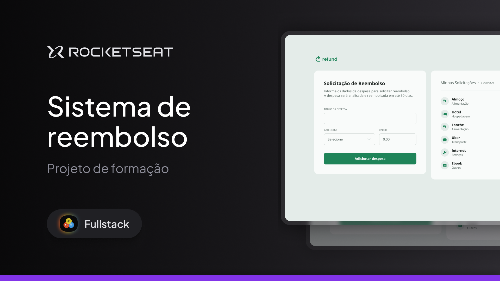

# 
 REFUND - SITE DE DESPESAS &nbsp;&nbsp;     

 Site Refund feito junto as aulas da Rocketseat para praticar tudo que foi aprendido no modulo de Javascript Intermediário do curso Fullstack. 
 
 

  [Projeto](#-projeto) &nbsp; | &nbsp; [Aprendizado](#-aprendizado) &nbsp;&nbsp;| &nbsp;&nbsp; [Tecnologia](#-tecnologia) &nbsp;&nbsp; 

 
 
 

## 🚀 PROJETO
 O *REFUND* é um aplicativo de reembolso que ao colocar os dados no input, ao lado ele adiciona um novo item com todas informações listadas no formulário.

## 📚 APRENDIZADO
Neste projeto pude utilizar e aprender novas técnicas e novos códigos para trabalhar nos projetos, alem de ampliar conhecimentos em métodos, eventos e variáveis.

## 💻 TECNOLOGIAS
Neste projeto foi utilizado apenas javascript para inteligência do site. HTML e CSS já vieram prontos.